<div align="center">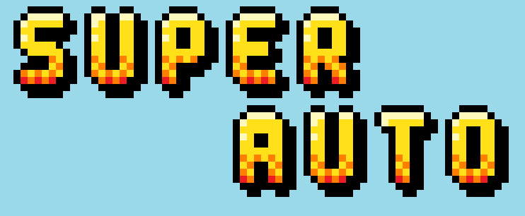</div>

<h3 align="center">Utilização do processador gráfico CoLenda no desenvolvimento de jogos 2D</h3>

<p align="center">Super Auto é um jogo 2D multiplayer de corrida de obstáculos implementado com a utilização do processador gráfico 
CoLenda e seu respectivo driver. Além do jogo, módulos kernel e bibliotecas foram implementados para realizar a comunicação botões push 
e displays de 7 segmentos.</p>
<div align="center">
	


</div>

<div align="center">
	
[Sobre o projeto](#sobre-o-projeto) • [Instalação](#instalação) • [Solução geral](#solução-geral) • [O jogo](#o-jogo) • [Testes](#testes)

</div>

## Sobre o projeto
Os anos 80 foram uma década revolucionária para os videogames, marcada por avanços tecnológicos significativos e o surgimento de jogos 
icônicos que moldaram a indústria. Jogos como <i>Space Invaders</i> e <i>Super Mario Bros</i>, que continuam a influenciar o design de 
jogos atuais, utilizavam representações bidimensionais chamadas <i>sprites</i> para elementos visuais do jogo como personagens e 
objetos. A animações promoveram uma melhor estética e interatividade fundamentais para a evolução da indústia de videogames.

Nesse cenário, Super Auto é um jogo bidimensional que utiliza sprites e outras representações em uma corrida de carros. Para tal, foi 
utilizado kit de desenvolvimento DE1-SoC juntamente com o processador gráfico CoLenda na HPS do kit. Que a corrida comece!


<details>
<summary> <b>Requisitos</b> </summary>

### Requisitos
O presente projeto deve atender às condições e aos requisitos predeterminados, de modo que:
- todos os códigos devem ser escritos na linguagem C e devem ser detalhadamente comentados;
- o kit de desenvolvimento De1-SoC deve ser utilizado para implementação do projeto;
- ao menos um novo sprite deve ser criado e utilizado;
- as ações do ator devem ser comandadas pelo mouse, que também deve refletir a velocidade no movimento;
- o display de 7-segmentos deve ser utilizado para a exibição das informações do jogo;
- o jogo deve permitir ações de pause, retorno, reinício e término por meio dos botões da DE1-SoC:
    - o usuário poderá parar e reiniciar o jogo em qualquer momento; 
    - o usuário poderá sair do jogo em qualquer momento;
- pelo menos um elemento passivo do jogo deverá se mover;
- a descrição técnica do projeto seja realizada no README do projeto;
- seja realizada a descrição dos testes de funcionamento, bem como dos resultados alcançados.


</details>
<details>
<summary><h2>Índice</h2></summary>

- [Instalação](#instalação)
	-  [Pré-requisitos](#pré-requisitos)
-  [Softwares utilizados](#softwares-utilizados)
	- [Linguagem C](#linguagem-c)
	- [Compilador GNU](#compilador-gnu)
 	- [VS Code](#vs-code)
  	- [Nano](#nano) 
- [DE1-SoC](#kit-de-desenvolvimento-de1-soc)
	- [Visão geral da DE1-SoC](#visão-geral-da-de1-soc)
  	- [Sistema computacional da placa](#sistema-computacional-de1-soc)
- [Processador gráfico](#processador-gráfico)
    - [Como funciona?](#como-funciona)
- [Periféricos utilizados](#periféricos-utilizados)
	- [Background](#-background)
		- [Padrão VGA](#padrão-vga)
	 	- [USB](#usb)
  	-  [Periféricos](#periféricos)
  		- [Saída VGA](#saída-vga-e-integração-com-a-gpu)
  	 	- [Mouse USB](#mouse-usb)
  	  	- [Botões push](#botões-de-tipo-push)
  	   	- [Display de 7 segmentos](#display-de-7-segmentos)
- [O Jogo](#o-jogo)
	- [Interface com o jogador](#interface-com-o-jogador)
	- [Elementos do jogo](#elementos-do-jogo)
 	- [Como jogar](#como-jogar)   
- [Solução geral](#solução-geral)
-[Gerenciamento da GPU](#gerenciamento-do-processador-gráfico-colenda)
	- [Background](#-background-1)
 		- [Threads e kthreads](#threads-e-kthreads)
   		- [Kfifo](#kfifo)
     		- [Waitqueue](#waitqueue)
       - [Alterações no driver Colenda](#-alterações-no-driver-colenda)
- [Gerenciamento dos pushuttons](#gerenciamento-dos-pushbuttons)
	- [Driver dos botões](#driver-dos-botões)
 	- [Biblioteca dos botões](#biblioteca-dos-botões)
  	- [Exemplo de utilização](#exemplo-de-utilização)
- [Gerenciamento dos displays de 7 segmentos](#gerenciamento-dos-displays-de-7-segmentos)
	- [Driver dos displays](#driver-dos-displays)
 	- [Biblioteca dos displays](#biblioteca-dos-displays)
- [Algoritmos do Jogo](#algoritmos-do-jogo)
	- [Criação de Sprites](#criação-de-sprites)
	- [Movimento e ações do jogador](#movimento-e-ações-do-jogador)
	- [Geração dos obstáculos](#geração-dos-obstáculos)
	- [Detecção de colisão](#detecção-de-colisão)
	- [Movimentação de elementos](#movimentação-de-elementos)
		- [Movimentação do plano de fundo](#movimentação-do-plano-de-fundo)
		- [Movimentação dos disparos](#movimentação-dos-disparos)
		- [Movimentação dos obstáculos](#movimentação-dos-obstáculos)
	- [Fluxo do jogo](#fluxo-do-jogo)
		- [Controle do fluxo da execução das threads](#controle-do-fluxo-da-execução-das-threads)
			- [Casos especificos de pause das threads](#casos-especificos-de-pause-das-threads)
			- [Criação e finalização das threads](#criação-e-finalização-das-threads)
- [Testes](#testes)
	- [Polling dos botões](#polling-dos-botões)
	- [Gerenciamento dos displays de 7 segmentos](#gerenciamento-dos-displays-de-7-segmentos)
	- [Jogo](#jogo)
- [Contribuições](#contribuições)

</details>
	
 ## Contribuidores

<a href="https://github.com/brendabo1"></a>
<a href="https://github.com/camilaqPereira"></a>
<a href="https://github.com/DestinyWolf"></a>


## Instalação

<details>
<summary><h3>Pré-requisitos</h3></summary>

- Possuir conexão com internet;
- Possuir instalado o compilador gcc;
- Possuir instalado o Git;
- Utilizar uma placa de desenvolvimento FPGA DE1-SoC;
- Possuir o processador gráfico CoLenda na FPGA;
- Possuir um monitor conectado à placa por meio da saída VGA
- Possuir um mouse USB conectado à placa

</details>

<details>
<summary><h3>Instalação dos drivers</h3></summary>
	
> WARNING
> **Este processo deve ser repetido para cada um dos drivers (colenda, pushbuttons e displays de 7 segmentos)**
#### 1. Clonar o repositório
Abra o terminal do seu dispositivo e execute o seguinte comando:
```
git clone https://github.com/DestinyWolf/Car_Race_CoLenda.git
```
**Transfira os arquivos do projeto para a placa DE1-SoC.**

#### 2. Acessar a pasta */source/drivers/-* e compilar o driver
Para acessar a pasta */source/drivers/-* e compilar o módulo kernel na placa, basta executar os seguintes comandos:
```
cd /source/driver/[HARDWARE_NAME]
make all
```
**HARDWARE_NAME será pushbuttons ou 7seg_display ou colenda**
#### 3. Carregar o módulo kernel
Na placa, execute os comandos:
```
sudo su
insmod [KERNEL_MODULE].ko
```
**KERNEL_MODULE será key_driver.ko or display_7seg_driver.ko ou colenda_update.ko**
#### 4. Buscar o valor major alocado dinamicamente
Execute o comando abaixo na placa e identifique o major associado ao driver a ser carregado.
```
cat /proc/devices
```
#### 5. Criar o device file
Execute os seguintes comandos na placa:
```
sudo su
mknod /dev/[FILE_NAME] c [MAJOR] 0
```
**FILE_NAME será key_driver ou display_7seg ou colenda** 
</details>

<details>
<summary><h3>Compilação do jogo</h3></summary>

#### 1. Acessar a pasta *source/Game* e compilar o jogo
Para acessar a pasta *source/Game* e compilar o jogo, basta executar os seguintes comandos:
```
cd /source/Game
make single_player
```
#### 2.Executar o jogo
Execute o comando:
```
./single_player
```
</details>

## Softwares utilizados


<details>
<summary> <b>Linguagem C</b> </summary>

### Linguagem C

É uma linguagem de programação de propósito geral que combina abstrações e controles de baixo nível sobre o hardware resultando em ganho 
de eficiência. O software criado em 1970 por 
Dennis Ritchie é estreitamente associada ao sistema operacional UNIX, uma vez que as versões desse sistema foram escritas em linguagem 
C. Além disso, a sintaxe simples e a alta 
portabilidade desta linguagem entre dispositivos contribui para seu amplo uso em sistemas embarcados de recursos limitados.

</details>
<details>
<summary> <b>Compilador GNU</b> </summary>

### Compilador GNU

O GNU Compiler Collection GCC (Coleção de Compiladores GNU), ou GCC, é um conjunto de compiladores de código aberto desenvolvido pelo 
Projeto GNU que oferecem suporte a uma gama de 
linguagens de programação, incluindo C, C++, Fortran, Ada e Go. Esta ferramenta otimiza a compilação, ou seja a produção de código de 
máquina, nas várias linguagens e arquiteturas de 
processadores suportadas.

</details>
<details>

<summary> <b>VS Code</b> </summary>

### VS Code
O Visual Studio Code, ou VS Code, é um editor de texto gratuito com suporte a várias linguagens de programação, incluindo Python, Java, 
C, C++ e JavaScript. A ferramenta desenvolvida pela Microsoft Corporation dispõe de diversos recursos de depuração, destaque de erros, 
sugestões, personalização dentre outros para auxiliar a codificação.

Saiba mais na [documentação oficial programa](https://code.visualstudio.com/docs#vscode)

</details>
<details>

<summary> <b>Nano</b> </summary>

### Nano
Também, o editor de texto simples Nano, na versão 2.2.6, presente no Linux embarcado do Kit de desenvolvimento DE1-SoC foi utilizado 
para codificação da solução. O Nano é um software leve e que oferece uma interface de linha de comando intuitiva, tornando-o ideal para 
rápida edição de arquivos, scripts e outros documentos de texto.

</details>

## Kit de desenvolvimento DE1-SoC

<details>
<summary><b>Visão geral da DE1-SoC</b></summary>

### Visão geral da DE1-SoC

Equipado com processador, USB, memória DDR3, Ethernet e uma gama de periféricos, o kit de desenvolvimento DE1-SoC (Figura 1) integra no 
mesmo Cyclone® V da Intel®, sistema em chip (SoC), um *hard processor system* (HPS) a uma FPGA (*Field Programmable Gate Arrays*). Este 
design permite uma grande flexibilidade da placa nas mais variadas aplicações. Para o acesso ao sistema operacional Linux embarcado na 
placa, o protocolo de rede SSH *(Secure Shell)* foi utilizado, estabelecendo uma conexão criptografada para comunicação entre a placa e 
computador *host*.

<div align="center">
  <figure>  
    
    <figcaption>
      <p align="center"> 

[**Figura 1** - Kit de Desenvolvimento DE1-SoC](https://fpgacademy.org/index.html)

</p>
    </figcaption>
  </figure>
</div>

</details>
<details>
<summary><b>Sistema computacional DE1-SoC</b></summary>

### Sistema computacional DE1-SoC

<div align="center">
  <figure>  
    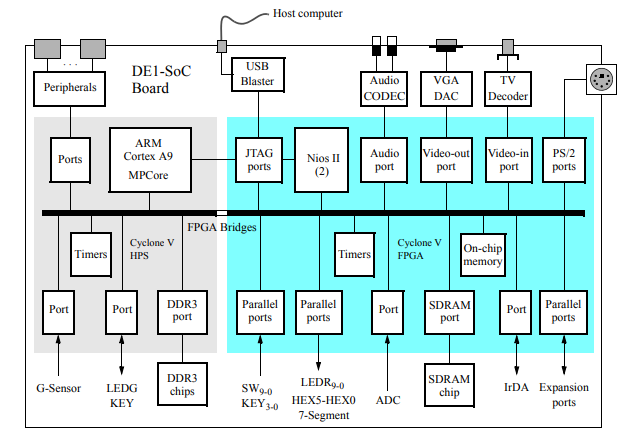
    <figcaption>
      <p align="center">

[**Figura 2** - Diagrama de Blocos da DE1-SoC](https://fpgacademy.org/index.html)

</p>
    </figcaption>
  </figure>
</div>

O diagrama de blocos do sistema computacional, apresentado na figura 2,  explicita os componentes do Cyclone® V da Intel®, bem como suas 
conexões. O HPS inclui um processador ARM® Cortex-A9 MPCore™ de 2 núcleos com uma distribuição Linux embarcada destinada a 
processamentos de propósito geral,  além da memória DDR3 e dos dispositivos periféricos. Já a FPGA possibilita uma variedade de 
implementações através da programação dos blocos lógicos.

> A comunicação bidirecional entre a o HPS e a FPGA se dá por meio das *FPGA bridges*. 
> No sentido HPS-FPGA, todos os dispositivos de entrada e saída (E/S) conectados à FPGA são acessíveis ao processador através do mapeamento de memória.
> As informações sobre o **endereçamento original** dos periféricos estão disponíveis na [documentação da placa](https://fpgacademy.org/index.html).

</details>

> [!WARNING]
> O processador gráfico Colenda é um hardware a parte implementado em uma FPGA e carregado no kit de desenvolvimento. Por isso, os
> endereços base físicos dos periféricos **não são os mesmos dos originais**. Além disso, por decisão de projeto, apenas a saída VGA, os
> displays de 7 segmentos e os botões do tipo push foram acoplados ao hardware. 

## Processador gráfico CoLenda

O processador gráfico CoLenda é um dispositivo gráfico, desenvolvido em uma FPGA, que permite o controle de polígonos convexos 
(triângulos e quadrados) e *sprites* em um monitor VGA com resolução de 640x480 pixels. Além do controle destes elementos, a GPU CoLenda 
permite a alteração da cor de fundo do monitor, alteração da cor de blocos de fundo de dimensão 8x8 e a criação *sprites* próprios. 

> [!NOTE]
> No projeto original, o NIOS II foi utilizado como unidade de processamento principal.
> No presente projeto, esta unidade foi substituída pelo HPS da placa DE1-SoC.

<details>
<summary><b>Como funciona?</b></summary>

### Como funciona?

O dispositivo gráfico CoLenda (figura 3) disponibiliza um conjunto de instruções para o gerenciamentos dos polígonos, sprites e 
background (mais informações sobre as instruções [aqui](https://drive.google.com/file/d/1MlIlpB9TSnoPGEMkocr36EH9-CFz8psO/view) e 
[aqui](https://github.com/camilaqPereira/coLenda_driver?tab=readme-ov-file#instru%C3%A7%C3%B5es)). Estes comandos são passados da HPS 
para o hardware na FPGA por meio dos barramentos de dados *dataA*, que recebe os dados de acesso à memória e registradores e dos 
*opcodes*, e *dataB*, que recebe os demais dados customizáveis tais como cores e posições.

Os dados nos barramentos são então escritos nas filas de instruções A e B, respectivas aos barramentos *dataA* e *dataB*. As FIFOs 
comportam cada uma um total de 16 palavras de 32 bits. Para que os dados sejam escritos nas filascorretamente são utilizados os sinais 
de controle:
- *wr_reg*(input): sinal de escrita nas FIFOs;
- _screen_(output): sinal que indica que a renderização de um frame foi finalizada;
- _wr_full_(output): sinal que indica que as filas estão cheias.

A escrita nas FIFOs deve ocorrer durante o período em que o sinal *screen*(output) está em alto (frame não está sendo renderizado). 
**Instruções escritas durante o processo de renderização de um frame correm o risco de ser perdidas! **. Durante este período, o sinal 
*wr_reg* deve ser colocado em alto por 1 pulso de clock. Este processo de escrita pode ser repetido até que o sinal *wr_full*(output)  
mude para alto (filas cheias) ou o sinal _screen_ mude para 0 (inicio da renderização de um frame).

Além dos sinais descritos acima, a GPU conta com mais um sinal de controle: *reset_pulse_counter*(output). Este sinal é utilizado para 
resetar o contador externo responsável por contar 
o tempo de renderização de uma tela.

<div align="center">
  <figure>  
    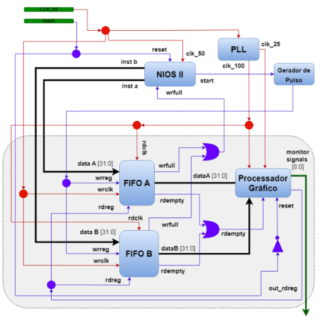
    <figcaption>
      <p align="center">

[**Figura 3** - Representação da arquitetura do processador gráfico](https://drive.google.com/file/d/1MlIlpB9TSnoPGEMkocr36EH9-CFz8psO/view)

</p>
    </figcaption>
  </figure>
</details>

## Periféricos utilizados

Neste projeto, utilizou-se todos os periféricos disponíveis no hardware do processador gráfico CoLenda: a saída VGA, os 4 botões do tipo *push* e os displays de 7 segmentos. Além disso, 
utilizou-se também dois mouses conectados à placa via USB.

### 📖 Background
<details>
<summary><b>Padrão VGA</b></summary>

### Padrão VGA

O padrão VGA é um modelo bastante utilizado, estando presente principalmente nos monitores do tipo CRT.
Este padrão é composto pela transmissão de sinais de geração de vídeo e sinais de cores (RGB - red, green, blue). Segue abaixo a especificação dos dois sinais de geração de vídeo:

- sinal de sincronismo horizontal (*hsync*): indica o tempo necessário para percorrer uma linha do monitor;
- sinal de sincronismo vertical (*vsync*): indica o tempo necessário para percorrer toda a tela (finalização de um frame);

Neste padrão, um frame é definido pelos parâmetros indicados na figura 4:
- área ativa: espaço de exibição dos pixels na tela;
- front e back porches: tempos de espera a serem implementados para delimitar a região ativa

<div align="center">
  <figure>  
    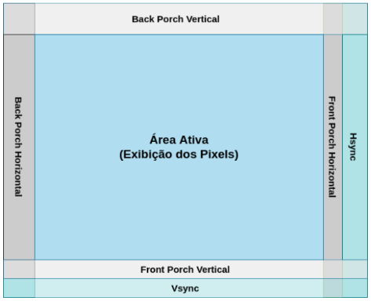
    <figcaption>
      <p align="center">

[**Figura 4** - Representação de um frame por meio do padrão VGA](https://drive.google.com/file/d/1MlIlpB9TSnoPGEMkocr36EH9-CFz8psO/view)

</p>
    </figcaption>
  </figure>
</div>

Estes parâmetros são calculados utilizando a resolução e taxa de atualização dos monitores. Os cálculos para a definição dos valores utilizados no projeto estão disponíveis na
[seção III.C deste arquivo](https://drive.google.com/file/d/1MlIlpB9TSnoPGEMkocr36EH9-CFz8psO/view). As especificações de parâmetros para diferentes resoluções podem ser encontrados no 
[manual da placa](https://fpgacademy.org/index.html)

</details>

<details>
<summary><b>USB</b></summary>

### USB
O Barramento Serial Universal, ou USB, é um padrão de conexão que permite a anexação de até 127 dispositivos sem a necessidade de reiniciar o computador, sendo assim realizadas todas as 
configurações para funcionamento do dispositivo em tempo de execução. Ademais, o padrão USB também dispensa o uso de drivers, fazendo com que toda a configuração do dispositivo seja 
automática. A comunicação entre um dispositivo _host_ (computador) e um periférico pode envolver a troca de ate três pacotes de dados, sendo o primeiro, enviado pelo host que informa 
dados como endereço do dispositivo de destino, tipo de transação, fluxo de dados, entre outros.

</details>

### 🖱️ Periféricos

<details>
<summary><b>Saída VGA e integração com a GPU</b></summary>

### Saída VGA e integração com a GPU

Na placa DE1-SoC, os sinais de sincronização são gerados diretamente pela Cyclone V SoC FPGA, com a conversão digital-analógica sendo feita por meio de Analog Devices ADV7123 para a 
representação das 3 cores RGB. Cada canal de cor RGB é representado por 8 bits e os sinais *hsync* e *vsync* são representados por 1 bit cada.
 
<div align="center">
  <figure>  
    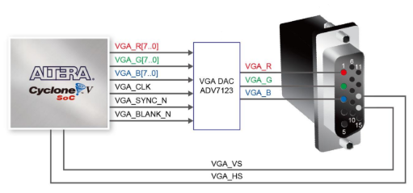
    <figcaption>
      <p align="center">

[**Figura 5** - Conexões entre FPGA e VGA](https://fpgacademy.org/index.html)

</p>
    </figcaption>
  </figure>
</div>

No projeto, a saída VGA foi conectada a um monitor de tubo CRT - *Cathode Ray Tube* -  com resolução de 640×480 pixels (figura 6) e uma taxa de atualização de 60Hz. Os sinais de geração 
de vídeo e de cores são controlados pelo *Controlador VGA* implementado pelo processador CoLenda.

<div align="center">
  <figure>  
    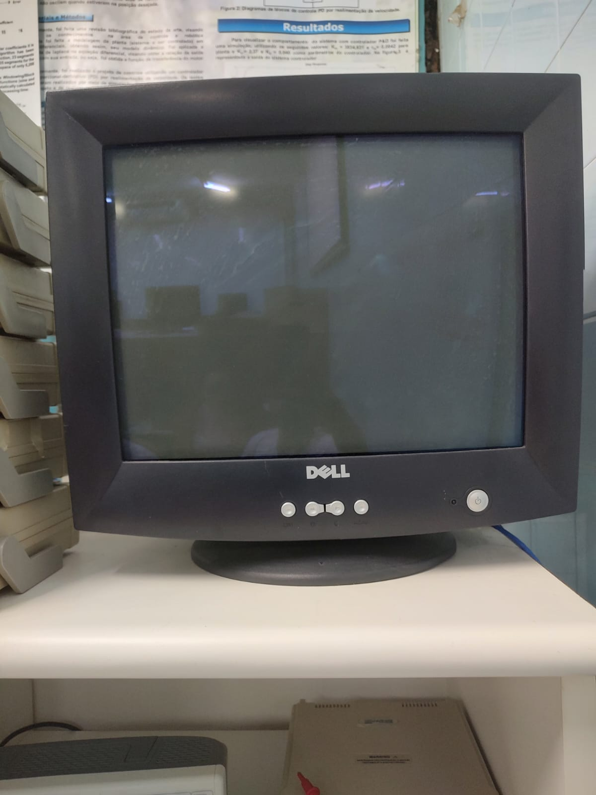
    <figcaption>
      <p align="center">

**Figura 6** - Monitor CRT usado

</p>
    </figcaption>
  </figure>
</div>
</details>

<details>
<summary><b>Mouse USB</b></summary>

### Mouse USB
Na placa DE1-SoC, os conectores USB estão ligados a um HUB controlador que se comunica diretamente com o HPS. Assim, o sistema operacional instalado e em execução na processador ARM da 
placa é quem gerencia as portas. Esta organização facilita o desenvolvimento e utilização das mesmas. Neste projeto, utilizou-se dois mouses idênticos (figura 7) cada um conectado à uma 
porta USB *host* da placa.

<div align="center">
  <figure>  
    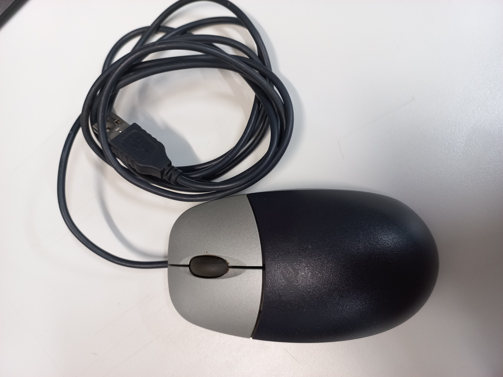
    <figcaption>
      <p align="center">

**Figura 7** - Mouse USB usado

</p>
    </figcaption>
  </figure>
</div>
</details>

<details>
<summary><b>Botões do tipo <i>push</i></b></summary>

### Botões do tipo *push*
A placa utilizada disponibiliza para o usuário quatro botões do tipo *push* (integrados à FPGA e à GPU), os quais possuem um registrador 
de dados. Este registrador possui 32 bits, sendo apenas os 4 menos significativos utilizados, e é usado para identificar quais botões 
estão pressionados em um determinado instante de tempo. Quando um botão é pressionado, seu bit correspondente no registrador (KEY0 -> 
bit 0, e assim por diante) é setado para 0. Quando liberado, o bit é setado para 1 novamente.

<div align="center">
  <figure>  
    
    <figcaption>
      <p align="center">

**Figura 8** - Endereçamento físico do botões (processador gráfico)

</p>
    </figcaption>
  </figure>
</div>

</details>

<details>
<summary><b>Displays de 7 segmentos</b></summary>

#### Displays de 7 segmentos
A DE1-SoC possui seis displays de 7 segmentos integrados à FPGA (e acoplados ao hardware processador gráfico). Os displays são do tipo anodo comum, o que significa que cada segmentos é acesso com um sinal baixo e apagado com um sinal baixo. No hardware da GPU, cada display possui um endereçamento físico independente.

<div align="center">
  <figure>  
    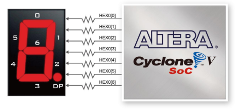
    <figcaption>
      <p align="center">

**Figura 9** -  Displays de 7 segmentos na DE1-SoC

</p>
    </figcaption>
  </figure>
</div>
</details>

## O Jogo

<details>
<summary> <b>Interface do Jogo</b> </summary>

### Interface do Jogo

A seguir, será apresentado a interface exibida para o jogador no monitor VGA e suas possíveis transições, bem como os cenários em que o uso dos botões interfere no estado do jogo.

O jogo parte da tela inicial que contém o título Super Auto e o menu de opções. Dentre as opções, o usuário pode escolher uma partida para um jogador (1), para dois jogadores (2), reiniciar o jogo (3) ou encerrá-lo (4). 

<div align="center">
  <figure>  
    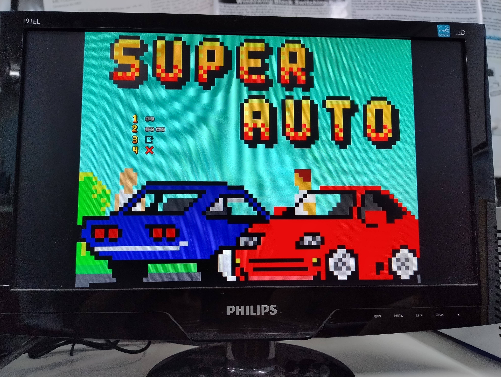
    
<figcaption>

**Figura 10** - Tela Inicial
    </figcaption>
  </figure>
</div>

Ao seleciona uma das opções de partida (1 ou 2), uma corrida será iniciada. Desse modo, o carro vermelho da imagem abaixo representa um jogador diante dos obstáculos durante a partida.
<div align="center">
  <figure>  
    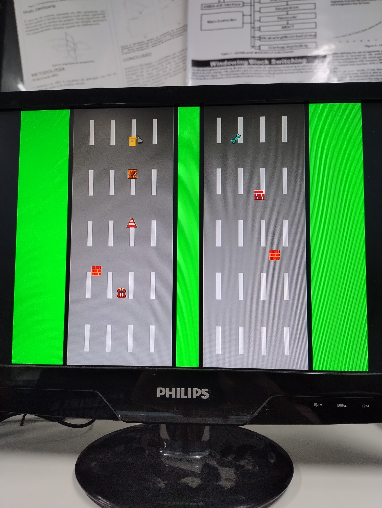
    
<figcaption>

**Figura 11** - Tela de uma partida em execução
    </figcaption>
  </figure>
</div>

Além disso, durante uma partida é possível pausa-la acionando o botão (2) que em sequencia exibirá a tela abaixo.

<div align="center">
  <figure>  
    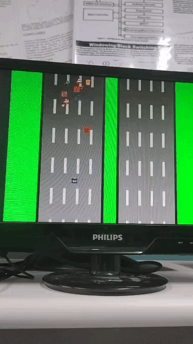
    
<figcaption>

**Figura 12** - Partida pausada
    </figcaption>
  </figure>
</div>

Quando um jogador atinge acima de 1000 pontos ou seu oponente perde, sua vitória é identificada por meio de uma animação exibida na figura 13.

<div align="center">
  <figure>  
    
    
<figcaption>

**Figura 13** - Animação de vitória do jogador ao atingir a pontuação máxima
    </figcaption>
  </figure>
</div>

Porém, ao colidir com um obstáculo durante uma partida, a pontuação do jogador é decrementada de acordo com o objeto. Dessa maneira, quando uma colisão ocorrer de maneira que o total de pontos do jogador seja igual ou menor do que 0, o usuário foi derrotado.
<div align="center">
  <figure>  
    
    
<figcaption>

**Figura 14** - Derrota do jogador após a colisão com pontuação insuficiente para o desconto do obstáculo. 
    </figcaption>
  </figure>
</div>

</details>

<details>
<summary> <b>Elementos do Jogo</b> </summary>

### Elementos do Jogo

A implementação deste jogo contou com o desenvolvimento de elementos fundamentais para uma boa experiência do usuário, sendo os obstáculos, carros e símbolos exibidos na figura 15 exemplos de elementos criados através de sprites. Dessa maneira, o objetos são representados com detalhes de pixels que contribuem para a para a maior jogabilidade dentro das condições e especificações doprojeto.

<div align="center">
  <figure>  
    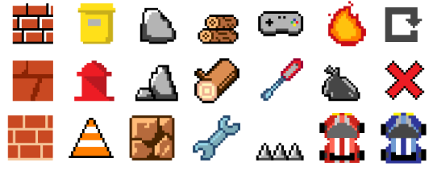
    
<figcaption>

**Figura 15** - Alguns dos sprites de elementos do jogo criados, incluindo os obstáculos e os carros dos jogadores
    </figcaption>
  </figure>
</div>

</details>


<details>
<summary> <b>Como Jogar</b> </summary>

### Como Jogar
.
Um ou dois jogadores competem em uma corrida de carros com o objetivo de destruir o máximo de obstáculos antes do seu oponente.
Vence o jogo quem atingir 1000 pontos primeiro ou aquele que evitar por mais tempo a colisão enquanto a sua pontuação for 0. Nesse jogo, cada obstáculo destruído acrescenta uma pontuação específica ao score do jogador. De maneira análoga, a colisão do carro com os objetos reduz uma determinada pontuação do score.
Para isso, o jogador conta com o mouse para movimentar o seu carro, desviando dos obstáculos ou eliminando-os. A cada clique com o botão esquerdo do mouse, um dos 5 tiros é disparado para eliminar o obstáculo alinhado a sua frente. E, após algum dos disparos desaparecer da tela, seja por atingir ou não algum elemento, o jogador terá consequentemente uma bala disponível.
</details>

## Solução Geral

<div align="center">
  <figure>  
    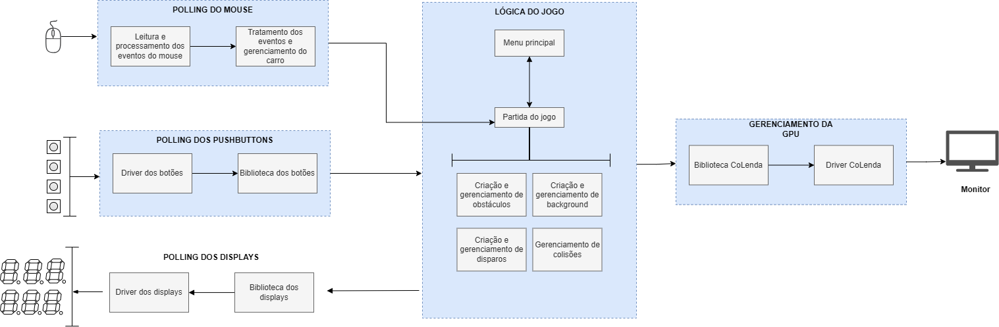
    <figcaption>
      <p align="center">

**Figura 16** - Esquema em blocos da solução geral
</p>
    </figcaption>
  </figure>
</div>

A aplicação desenvolvida integra os módulos de gerenciamento de hardware ( _pooling_ dos _pushbuttons_ e do mouse USB, controle do 
processador gráfico e dos displays de 7 segmentos) com a lógica do jogo de corrida implementada a fim de criar um produto que atenda aos 
requisitos propostos. O fluxo de informações da aplicação desenvolvida está esquematizado na figura 16.

Os módulos de *polling* dos botões e do mouse USB realizam a captura dos eventos de seus respectivos hardwares e a conversão desses para 
informações úteis ao bloco da lógica do jogo. Por sua vez, os blocos de *polling* dos displays de 7 segmentos e de gerenciamento do 
processador gráfico recebem informações do bloco do jogo e as convertem para serem exibidas exibidas por seus respectivos hardwares.

O bloco da lógica do jogo consome as informações fornecidas pelos blocos de gerenciamento dos botões e do mouse e as utiliza para o 
controle e a execução do fluxo do jogo. Os elementos a serem exibidos no monitor são passados ao módulo de gerenciamento da GPU e as 
informações sobre pontuação são passadas ao módulo de *polling* dos displays.

## Gerenciamento do processador gráfico CoLenda

Para o envio de informações ao processador gráfico CoLenda, utilizou-se o driver e a biblioteca disponíveis [neste repositório](https://github.com/camilaqPereira/coLenda_driver). A fim de maximizar a eficiência da GPU e reduzir o tempo de ociosidade aguardando pelo esvaziamento das FIFOs e/ou pela finalização da renderização de um frame, algumas modificações foram implementadas ao driver.

### 📖 Background
<details>
<summary><b>Threads e kthreads</b></summary>
Também chamados de miniprocessos, as threads compartilham um conjunto de recursos, tal como o espaço de endereçamento, de maneira que possam trabalhar juntos intimamente para desempenhar alguma tarefa, precisamente a interação desejada entre os módulos. As *kthreads* são threads dentro do espaço kernel. Essas podem ser usadas para executar tarefas em segundo plano em device drivers, esperando por eventos assíncronos ou ainda executar uma atividade em períodos de tempo programados.

O sistema operacional Linux disponibiliza uma interface para o gerenciamento das *kthreads*: `linux/kthread.h`. Esta interface apresenta funções para a criação, execução e diversas outras atividades. 

Saiba mais sobre *kthreads* em: [Trabalhando com kernel threads por Sergio Prado](https://sergioprado.org/linux-device-drivers-trabalhando-com-kernel-threads/), [Linux Kernel Docs](https://www.kernel.org/doc/html/v5.9/driver-api/basics.html), [Kernel Threads por Embetronix](https://embetronicx.com/tutorials/linux/device-drivers/linux-device-drivers-tutorial-kernel-thread/)

</details>

<details>
<summary><b>Kfifo</b></summary>
</details>

<details>
<summary><b>Kfifo</b></summary>
</details>

### 🆕 Alterações no driver CoLenda
Uma *kfifo* foi adicionada ao driver para o armazenamento das instruções originadas das chamadas de sistema *write*. Esta fila possui uma capacidade de 4096 caracteres, totalizando 512 instruções. Além disto, foi implementada uma *kthread* para gerenciar o processo de escrita nas filas de instruções da GPU e um callback write bloqueante para evitar a perda de instruções. As rotinas da escrita bloqueante e da *kthread*, bem como a comunicação entre elas,  são apresentados na figura 17. Para o bloqueio dos processos, foi utilizado duas *waitqueues*: uma para a *kthtread* consumidora e outra para os processos escritores.

<div align="center">
  <figure>  
    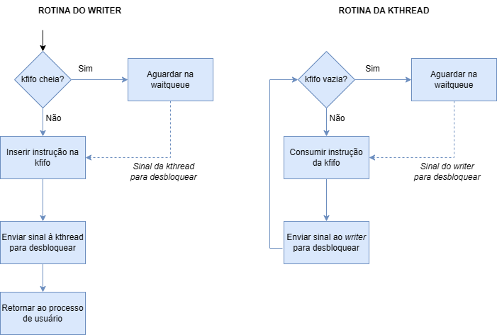
    <figcaption>
      <p align="center">

**Figura 17** - Dinâmica da *kthread* e da leitura bloqueante
</p>
    </figcaption>
  </figure>
</div>

## Gerenciamento dos *pushbuttons*
Para o gerenciamento dos eventos dos botões do tipo *push*, foram implementados um módulo kernel e uma biblioteca. O módulo kernel é responsável pela comunicação com os botões, isto é, pela leitura do registrador de dados e identificação de pressionamento de botões. Por sua vez, a biblioteca é responsável pela abstração da comunicação entre o driver e a aplicação do usuário. O fluxo de informações entre o módulo kernel, a biblioteca e a aplicação do usuário é ilustrado na figura 18.

<div align="center">
  <figure>  
    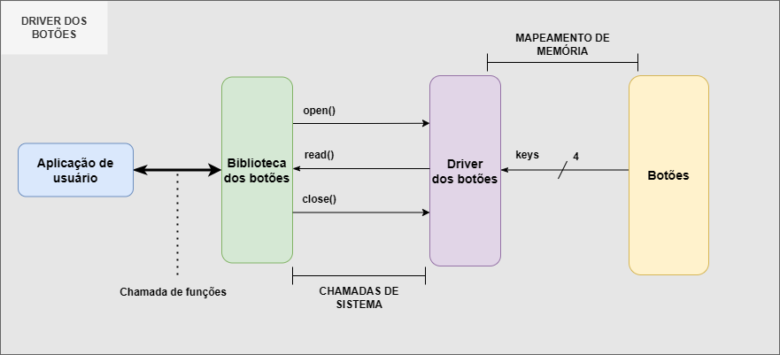
    <figcaption>
      <p align="center">

**Figura 18** - Fluxo de informações no gerenciamento dos botões  *
</p>
    </figcaption>
  </figure>
</div>

<details>
<summary><b>Driver dos botões</b></summary>
	
### Driver dos botões
Devido a falta de suporte para interrupções de hardware nos botões acoplados ao processador gráfico, fez-se necessária a utilização de 
uma máquina de estados finita (MEF) para o correto *polling* botões. Uma *kthread* permanece bloqueada (por meio de uma waitqueue) até 
que um callback *open* seja executado. A partir daí, este miniprocesso percorre a rotina da MEF, ilustrada na figura 19,  para a leitura 
dos botões. O processo leitor é então bloqueado na chamada *read* (por meio de outra waitqueue) até que ocorra a detecção do 
pressionamento de um botão.

<div align="center">
  <figure>  
    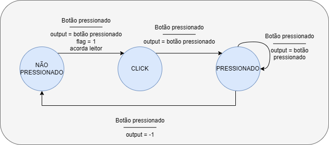
    <figcaption>
      <p align="center">

**Figura 19** - Esquema da MEF da leitura dos botões
</p>
    </figcaption>
  </figure>
</div>

> Por decisão de projeto, pressionamentos simultâneos de dois ou mais botões não são detectados. Nestes casos, o botão a ser 
> detectado primeiro é o único a ser lido.

</details>

<details>
<summary><b>Biblioteca dos botões</b></summary>
	
### Biblioteca dos botões
A biblioteca implementada fornece uma maior facilidade para o gerenciamento dos botões. 
#### 🚀Features
- **encapsulamento** da comunicação com o driver dos botões: funções open e close;
- **facilidade de identificação** dos botões pressionados: constantes de identificação;
- **encapsulamento da leitura**: função read.
	
</details>
<details>
<summary><b>Exemplo de utilização</b></summary>
	
O código abaixo exemplifica utilização da biblioteca para a leitura dos eventos dos botões

```c
#include<stdio.h>
#include<stdlib.h>
#include<unistd.h>
#include<fcntl.h>
#include "keys.h"

int main(int argc, char const *argv[]){
  char button = ' ';
  KEYS_open();

  while(button != '3'){
    KEYS_read(&button);
    printf("Button pressed: %c\n", button);
  }
  KEYS_close();
  return 0;
}
```
> **O código acima parte do pressuposto que o driver dos botões está carregado e nó já foi criado!!**

</details>

## Gerenciamento dos displays de 7 segmentos
Para o gerenciamento da exibição de informações nos displays de 7 segmentos, foram implementados um módulo kernel e uma biblioteca. O módulo kernel é responsável pela comunicação com os displays, isto é, pela escrita nos registradores de dados de cada display. Por sua vez, a biblioteca é responsável pela abstração da comunicação entre o driver e a aplicação do usuário. O fluxo de informações entre o módulo kernel, a biblioteca e a aplicação do usuário é ilustrado na figura 20.

<div align="center">
  <figure>  
    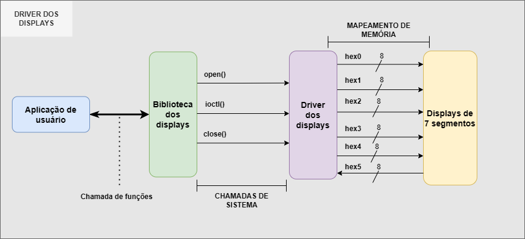
    <figcaption>
      <p align="center">

**Figura 20** - Fluxo de informações no gerenciamento dos displays de 7 segmentos
</p>
    </figcaption>
  </figure>
</div>

<details>
<summary><b>Driver dos displays</b></summary>
	
### Driver dos displays

O driver dos displays de 7 segmentos implementa, além das funções open e close, a chamada de sistema *ioctl* com o comando *write*.

>"ioctl() is the most common way for applications to interface with device drivers. It is flexible and easily extended by adding new 
>commands and can be passed through character devices, block devices as well as sockets and other special file descriptors."
>[The Linux Kernel](https://docs.kernel.org/driver-api/ioctl.html)

> Sobre comandos: "IO/_IOR/_IOW/_IOWR The macro name specifies how the argument will be used. It may be a pointer to data to 
> be passed into the kernel (_IOW), out of the kernel (_IOR), or both (_IOWR). _IO can indicate either commands with no argument 
> or those passing an integer value instead of a pointer."
> [The Linux Kernel](https://docs.kernel.org/driver-api/ioctl.html)


Aproveitando a flexibilidade da chamada *ioctl*,  o usuário pode passar como parâmetro a struct `ioctl_args` (definida abaixo). A partir desta struct, o módulo kernel consegue identificar qual display receberá o código de segmentos passado.
```c
struct {
	uint8_t hex_id; //identificação do display: 0 a 6
	uint8_t data; //código dos segmentos: gfedcba
} ioctl_args_t;
```

</details>

<details>
<summary><b>Biblioteca dos displays</b></summary>
	
### Biblioteca dos displays
A biblioteca implementada fornece uma maior facilidade para o gerenciamento dos displays. 
#### 🚀Features
- **encapsulamento** da comunicação com o driver dos displays: funções open e close;
- facilidade de **identificação dos displays**: constantes de identificação;
- facilidade de **identificação dos códigos de segmentos** de cada número e letra: constantes de identificação;
- **encapsulamento da leitura**: função read.
- **encapsulamento de atividade triviais**: apagar displays, escrever números de até 6 dígitos de 1 vez, escrever palavras, animações;

</details>


## Algoritmos do Jogo

<details>
<summary> <b>Criação de Sprites</b> </summary>

### Criação de Sprites

A criação do bitmap de novos sprites é feita por meio de um algoritmo em Python que utiliza a biblioteca _pillow_. É realizada a leitura da imagem e a conversão da mesma em uma matriz de valores, contendo a coordenada do pixel e as cores RGB, além do fator opacidade. O fator opacidade é utilizado pra definir quando é um pixel é invisível para que sua cor seja substituída pelo padrão invisível da GPU. Nos valores de cores é realizada uma conversão do valor da cor lido pra sua correspondente de 3 bits, que é o padrão de cor utilizado na GPU. 

Ao final, é gerado um arquivo de texto com o código para a geração daquele sprites na GPU. Basta copiar seu conteúdo e utilizar em arquivos C.

<div align="center">
  <figure>  
    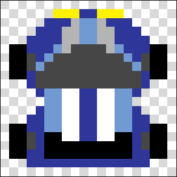
    
<figcaption>

**Figura 21** - Matriz de pixel para a geração do sprite
    </figcaption>
  </figure>
</div>

**A biblioteca CoLenda também foi atualizada para suportar esta nova funcionalidade.** Para isto, criou-se uma nova pseudo instrução que facilita a criação de sprites. Esta recebe um vetor de cores com 400 espaços, correspondente aos 400 pixels de um sprite. A função realiza a leitura do vetor e faz chamadas para a função *set_pixel*, passando valor por valor do pixel desejado. 

Esta pseudo instrução abstrai assim a necessidade do programador entender como está estruturado essa criação dentro da GPU.

</details>


<details>
<summary> <b>Movimento e ações do jogador</b> </summary>

### Movimento e ações do jogador

A movimentação do sprite do jogador ocorre apenas no eixo _X_, ela é feita na thread do polling do mouse, onde é feita a leitura dos eventos do mouse e após isso, é atualizada a nova posição do jogador. Caso ocorra alguma movimentação no eixo _X_, esse valor é lido e transformado em um valor valido para o jogo, de -2 a 2, e multiplicado pela velocidade base do carro que é de 2 pixeis por frame, esse valor é incrementado, ou decrementado, na posição do carro e o mesmo é exibido na tela nessa nova localização.
No momento de atualizar a posição do jogador é verificado 2 possiveis ocorrencias:

>- **O carro do jogador já esta localizado em uma das bordas:**
Neste caso nada ocorre e o carro é desenhado na mesma posição
>
>- **O deslocamento total é maior do que o espaço existente entre a borda e o carro**:  Nesse caso, é calculado o espaço de deslocamento que o carro tem antes de chegar a borda e esse valor se torna o novo deslocamento queserá realizado pelo carro.

Caso não haja nenhuma das ocorrencias anteriores a posição do carro é atualizada normalmente, e o carro é desenhado na nova posição.

Outra ação que o jogador pode fazer é clicar com o botão esquerdo do mouse pra realizar disparos, a geração desses disparos ocorre na thread do polling do mouse, porém a atualização de sua posição e checagem de colisão ocorre em outras threads.

No momento que ocorre a captura de um evento de clique, verifica-se se é do botão esquerdo e é verificado também se o jogador pode realizar algum disparo, cada jogador tem 5 disparos, a cada disparo esse valor é decrementado, quando um tiro chega a borda superior da tela ou colide com um obstáculo esse contador é incrementado e assim o jogador pode vir a realizar um novo disparo.

</details>

<details>
<summary> <b>Geração dos obstáculos</b> </summary>

### Geração dos obstáculos

A geração de obstáculos na tela segue uma sequência de etapas para que aleatoriamente um novo objeto seja posicionado no topo da tela. Inicialmente uma coordenada do eixo x é gerada aleatoriamente dentro dos limites de coordenada da pista de corrida e considerando a posição do jogador no eixo_x para que o obstáculo seja criado nas redondezas. Já o eixo y é constante, uma vez que o objeto será produzido no topo da tela. Em seguida, um dos 16 obstáculos é selecionado aleatoriamente e um sprite do elemento é criado nas coordenadas x e y definidas, conforme demostrado no diagrama da figura 22. Durante uma partida, cada jogador pode ter até 10 obstáculos ao mesmo tempo em sua pista, tendo cada um deles velocidade e pontuação específicas.

<div align="center">
  <figure>  
    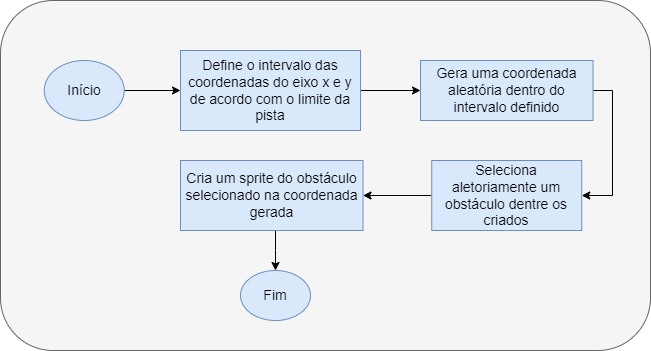
    
<figcaption>

**Figura 22** - Diagrama de blocos para a geração aleatória de obstáculos
    </figcaption>
  </figure>
</div>

</details>

<details>
<summary> <b>Detecção de colisão</b> </summary>

### Detecção de colisão

A detecção de colisão no jogo funciona analisando se alguma parte da area do jogador esta dentro da area do objeto, a imagem abaixo descreve um caso de colisão.


> [!NOTE]
> A colisão pode ocorrer lateralmente tambem

Quando é detectada a colisão do jogador com um obstáculo é iniciado um timer e o jogador fica invuneravel por 1 segundo, esse tempo de invunerabilidade é indicado pelo piscar do carro e, enquanto estiver nesse estado, a colisão do jogador é desabilitada permitindo que o mesmo perceba e desvie dos próximos obstáculos. Outro evento que ocorre em conjunto é o desaparecer do obstáculo a qual o jogador colidiu e a diminuição da pontuação daquele objeto dos pontos do jogador.

> O mesmo calculo e verificação de colisão é realizado para os disparos, com a diferença que o disparo possui uma area menor que o obstáculo e o jogador.

Uma diferença entre a colisão de um disparo com um obstáculo é que quando colide com um obstáculo o sprite do obstáculo é trocado por uma chama que desaparece após um curto período, apenas pra indicar que naquele local houve uma colisão. No momento que é detectada a colisão do disparo com um obstáculo é acrescida a pontuação do jogador o valor do objeto destruído.

Outros dois pontos de analise de colisão é o disparo chegar ao topo da tela e o obstáculo chegar ao final, onde os mesmos devem desaparecer, nesse caso é analisado se o valor da coordenada _Y_ deles são iguais a 479, pros obstáculos, e 0, para os disparos.

Ao final é verificado se algum jogador perdeu, _sua pontuação ser menor que zero_, ou se algum ganhou, _pontuação ser maior ou igual a 1000_, nesses casos são chamadas as telas de **vitória** ou **derrota** respectivamente.

</details>

<details>
<summary> <b>Movimentação de elementos</b> </summary>

### Movimentação de elementos

A atualização da posição de alguns sprites e o cenário de fundo é realizado em funções distintas e abaixo segue uma breve explicação de como objetos distintos tem suas posições atualizadas.

<details>
<summary> <b>Movimentação do plano de fundo</b> </summary>

#### Movimentação do plano de fundo

Para passar a sensação de movimento é realizada a alteração da pista do fundo, dando a entender que o carro se move para frente, entretanto o mesmo permanece parado no eixo. Devido a limitações de hardware a unica parte da pista que realmente é alterada a cada 100 ms são as listras brancas, o que diminui significativamente o gasto de recursos de hardware, outra opção seria redesenhar toda a pista a cada frame mas foi notado que seria muito custoso e afetaria de maneira significativa o desempenho do jogo pois introduziria latencia e ghosting no movimento do usuario

>**Ghosting:** Termo utilizado para quando se tem um processador mais rapido que a unidade grafica e assim a imagem que é exibida na tela não esta sincronizada com o que esta sendo processado dando a impressão de _latência_ ou imprecisão nos comandos relizados.

>**Latência:** Termo utilizado para se referir ao tempo que uma instrução leva para ser processada e exibida na tela

</details>
<details>
<summary> <b>Movimentação dos disparos</b> </summary>

#### Movimentação dos disparos

Os disparos realizados pelo jogador tem sua posição atualizada em uma thread diferente daquela onde são gerados, isso ocorre para garantir que os disparos vão ter sua atualização independente da leitura de algum evento do mouse.

A thread de atualização dos disparos fica responsavel por pegar a posição deles e subtrair o valor padrão da aceleração no eixo _Y_, pois como eles estão subindo o valor da sua coordenada _Y_ deve reduzir com o passar do tempo. Quando os disparos chegam a borda superior da tela sem colidir com nenhum obstáculo, ou seja, seu valor pra _Y_ é 0 ou menor que 15, o disparo desaparece e o jogador ganha mais uma munição para disparar.

</details>

<details>
<summary> <b>Movimentação dos obstáculos</b> </summary>

#### Movimentação dos obstáculos

O movimento dos obstáculos na pista é retilíneo e uniforme, ou seja, é realizado em linha reta e com velocidade constante.  Cada obstáculo possui uma velocidade definida, o que faz com que ele percorra uma determinada distância em um período de tempo. Dessa maneira, como representado no diagrama da figura 23, o eixo y dos objetos na tela é incrementado pelo deslocamento calculado a partir da velocidade de cada obstáculo. Assim, os obstáculos realizam um movimento descendente do topo da tela até a base, tendo sua posição atualizada de acordo com sua velocidade.

<div align="center">
  <figure>  
    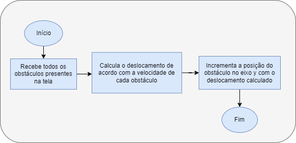
    
<figcaption>

**Figura 23** - Diagrama de blocos da Movimentação dos obstáculos na tela
    </figcaption>
  </figure>
</div>

</details>
</details>
</details>

<details>

<summary> <b>Fluxo do jogo</b> </summary>

## Fluxo do jogo

O diagrama abaixo descreve o fluxo de execução do jogo


Para garantir que o jogo respondesse aos comandos de maneira eficaz e um bom aproveitamento do hardware, o software foi divido em threads onde cada uma possui suas reponsabilidades de maneira que uma thread não interferisse de maneira direta no funcionamento de outra.
>O unico momento que uma thread vem a interferir no funcionamento das demais é na ocorrencia do acesso a variaveis compartilhadas

A tabela abaixo descreve as threads criadas e suas responsabilidades

Thread              |                  Responsabilidade
:----------------------|:-----------------------------
_Polling do mouse do jogador 1 e 2_| Realiza a leitura dos eventos do mouse e realiza o tratamento dessas entradas
_Atualização do background_ | Faz a atualização da pista para criar impressão de movimento
_Atualização dos disparos_ | Faz a atualização da posição dos disparos de ambos os jogadores
_Timers de invunerabilidade 1 e 2_ | Timer ativado quando um jogador colide com um obstáculo
_Verificação de colisão_ | Responsavel por verificar a colisão e fazer a checagem de condição de vitória ou derrota
Geração de obstáculos | Gera os obstáculos na tela e faz a atualização de suas posições
_Menu_ | Menu do jogo, fica rodando durante o jogo realizando a captua das entradas dos botões da FPGA


<details>
<summary> <b>Controle do fluxo da execulçao das threads</b> </summary>

### Controle do fluxo da execução das threads

O fluxo do jogo é controlado por uma maquina de estados simples que esta na thread principal, a thread do menu. O diagrama abaixo descreve em alto nivel a maquina de estados e suas condições de transição


No caso a thread principal do menu fica responsavel por alterar entre esses estados e assim se torna possivel gerenciar quando algumas threads devem ser pausadas ou não.

>Exemplo: enquanto o usuario está no menu não há motivos para nenhuma outra thread está rodando.

Assim, foram estabelecidas condições de parada das threads, uma das condições de pause das threads é o jogo estar no menu, outra condição de pausa das threads é o jogo estar em estado de pause durante alguma partida. Caso algum jogador ganhe, as threads tambem são pausadas.


<details>
<summary> <b>Casos especificos de pause das threads</b> </summary>

#### Casos especificos de pause das threads

como há um grande compartilhamento de variaveis e vetores, em certos momentos é necessario que algumas threads sejam interrompidas para que o valor lido seja o correto.
>Exemplo: Quando o jogador colide com um obstáculo, tanto a thread de geração dos obstáculos quanto a thread do polling do mouse daquele jogador são pausadas.

A seguinte tabela descreve os cenarios e casos particulares de quando cada thread é interrompida visando a garantia da consistência dos dados.

Caso    | Threads que sao paradas
:------|:-----------------------------
_Jogador colide com obstáculo_ | Obstáculos, Colisão e Polling do mouse
_Disparo colide com obstáculo_ | Obstáculos, Atualização dos disparos, Polling do mouse.
_Partida single player_ | Polling do mouse do segundo jogador

</details>

<details>
<summary> <b>Criação e finalização das threads</b> </summary>

#### Criação e finalização das threads

Todas as threads são criadas na inicialização do jogo e a depender do modo de jogo escolhido apenas a thread do mouse do segundo jogador tem sua execução opcional. Ao invés de encerrar as threads foi optado por apenas pausar suas execuções enquanto não forem utilizadas.

O unico momento em que as threads são de fato finalizadas é o momento em que o jogador opta por encerrar o jogo, só então são finalizadas e o programa é encerrado.

</details>
</details>
</details>

## Testes

<details>
<summary> <b>Polling dos botões</b> </summary>

### Polling dos botões
Para a avaliação do driver dos botões e da sua respectiva biblioteca, utilizou-se uma aplicação de usuário executando [o código de exemplo](#exemplo-de-utilização). Buscou-se testar os seguintes casos:

- Click curto: pressionando rapidamente o botão 1. Espera-se que o identificador do botão 1 seja retornado apenas uma vez
- Click longo: pressionando o botão 2 por 1 segundo. Espera-se que o identificador do botão 2 seja retornado apenas 1 vez
- Click duplo: pressionando e segurando o botão 2 e, em seguida, pressionando o botão 0. Espera-se que apenas o identificar do botão 2 seja retornado (apenas 1 vez).
Como pode-se observar na figura 24 e 25, todos resultados condizem com o esperado.


<div align="center">
  <figure>  
    
    
<figcaption>

**Figura 24** - Acionamento curto de um dos botões seguido do acionamento longo e acionamento de 2 botões.
    </figcaption>
  </figure>
</div>

<div align="center">
  <figure>  
    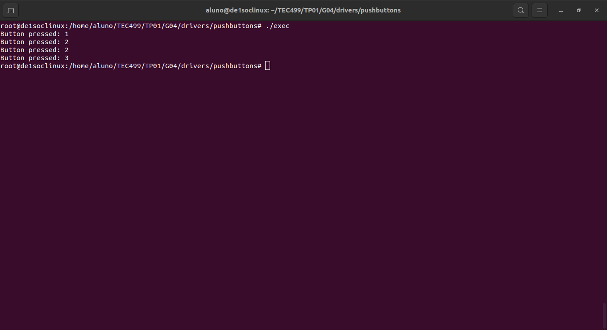
    
<figcaption>

**Figura 25** - Acionamento curto de um dos botões seguido do acionamento longo e acionamento de 2 botões.
    </figcaption>
  </figure>
</div>
</details>

<details>
<summary><b>Gerenciamento dos displays de 7 segmentos</b></summary>

### Gerenciamento dos displays de 7 segmentos

Para a avaliação do driver dos displays e da sua respectiva biblioteca, buscou-se testar os seguintes casos:
- Limpar: espera-se que todos os displays sejam apagados;
- Escrita em um dígito: espera-se que o dígito 4 seja exibido no display 3;
- Escrita em todos os displays: espera-se que o número 012345 seja exibido no displays displays de 5 a 0, respectivamente;
- Escrita de um score: espera-se que o valor 345 seja escrito nos displays de 2 a 0, respectivamente;
- Escrita de uma palavra: espera-se que a palavra 'pause' seja escrita nos displays de 5 a 1 e o 0 seja apagado;
- Animação do título do jogo: espera-se que 'Super Auto' seja exibido nos displays em deslocamento da direita para a esquerda;

Para isso, utilizou-se o código abaixo. Como pode-se observar na figura 26, os resultados obtidos condizem com os esperados.
```c
#include<stdio.h>
#include<stdlib.h>
#include<unistd.h>
#include<fcntl.h>
#include<time.h>
#include "display_7seg.h"

int main(){
	display_open();
	display_clear();
	usleep(1000000);
	display_write_digit(HEX3, 4);
	usleep(1000000);
	display_write_int(12345);
	usleep(1000000);
	display_write_score(345, 0);
	usleep(1000000);
	uint8_t letters[] = {P_DISPLAY,A_DISPLAY,U_DISPLAY,S_DISPLAY,E_DISPLAY,OFF_DISPLAY};
	display_write_word(letters);
	usleep(1000000);
	display_title_animation();
	display_close();

	return 0;
}

```

<div align="center">
  <figure>  
    
    
<figcaption>

**Figura 26** - Resultados nos displays de 7 segmentos

    </figcaption>
  </figure>
</div>

</details>

<details>
<summary> <b>Jogo</b> </summary>

### Jogo
Para o teste da execução da lógica do jogo, o executável foi utilizado. A seguir, estão listados os casos de teste e os resultados obtidos.


- Destruição de um obstáculo - display (figura 27): espera-se que a pontuação do player aumente
<div align="center">
  <figure>  
    
    
<figcaption>

**Figura 27** - Atualização da pontuação ao destruir um obstáculo
    </figcaption>
  </figure>
</div>

- Colisão com um obstáculo - display (figura 28): espera-se que a pontuação do player diminua
<div align="center">
  <figure>  
    
    
<figcaption>

**Figura 28** - Atualização da pontuação ao colidir com um obstáculo
    </figcaption>
  </figure>
</div>

- Destruir obstáculo por meio do tiro (figura 29): espera-se que o obstáculo e o tiro desapareçam
- Atirar (figura 29): espera-se que o tiro apareça na frente do carro e se desloque para o topo da tela

<div align="center">
  <figure>  
    
    
<figcaption>

**Figura 29** - Destruição dos obstáculos através do tiro
    </figcaption>
  </figure>
</div>

- Obstáculo no fim da tela (figura 30): espera-se que os elementos desapareçam 

<div align="center">
  <figure>  
    
    
<figcaption>

**Figura 30** - Obstáculos no fim da tela
    </figcaption>
  </figure>
</div>

- Colisão com obstáculo (figura 31): espera-se que a o player pisque e fique invulnerável por 1 segundo;

<div align="center">
  <figure>  
    
    
<figcaption>

**Figura 31** - Estado de invulnerabilidade
    </figcaption>
  </figure>
</div>

- Pause e play: espera-se a execução da partida seja travada e uma mensagem seja exibida

<div align="center">
  <figure>  
    
    
<figcaption>

**Figura 32** - Pause e play
    </figcaption>
  </figure>
</div>

- Vencer (figura 33): espera-se que os obstáculos desapareçam, o player desloque-se ao topo da tela e uma mensagem apareça;

<div align="center">
  <figure>  
    
    
<figcaption>

**Figura 33** - Player venceu
    </figcaption>
  </figure>
</div>

- Perder (figura 34): espera-se que os obstáculos desapareçam, uma mensagem seja exibida e o jogo retorne ao menu principal;

<div align="center">
  <figure>  
    
    
<figcaption>

**Figura 34** - Player perdeu
    </figcaption>
  </figure>
</div>
</details>

## Contribuições
Todas as contribuições são bem-vindas, sejam elas para o código ou para a documentação. Para isso, utilize a formatação e as versões adotadas no projeto, realize os testes necessários para manter a integração, bem como adote pull requests para cada modificação.
